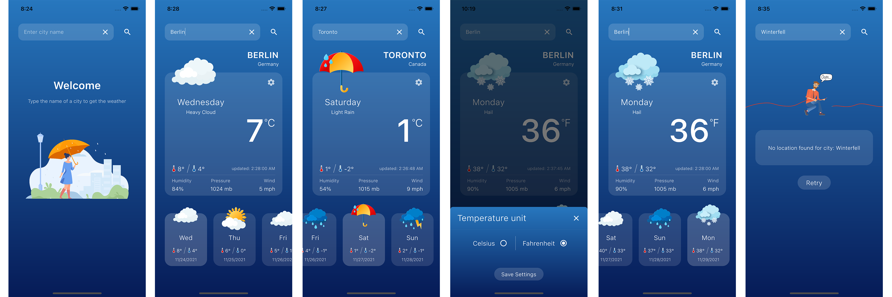

# Weather app built in Flutter using Riverpod and MetaWeather API



The [MetaWeather API](https://www.metaweather.com/api/) is used to fetch from a city their weather data [current, minimum and maximum temperature, weather state, date, humidity, pressure and wind speed].
## Requirements that the app meets
- A loading indicator is displayed when fetching the data
- The weather list item contains the day of the week abbreviation, weather condition image, min and max temperature
- The weather details contain the day of the week, weather condition name and image, current temperature, humidity, pressure, and wind
- When selecting a whether list item updates the details
- Weather information can be refreshed with pull to refresh gesture
- An error screen with a retry button is shown when fetching the data fails.
- Supporting horizontal and vertical layouts
- Changing the temperature unit (C/F)

## App Folder Structure

- The `models` weather class to represent data from API
- The `providers` riverpod state management classes
- The `services` fetching data from API and shared preferences
- The `design_system` all related to colors, fonts, assets
- The `misc` helper reusable widgets and functions
- The `views` main UI views of the app
- The `widgets` widgets components

```
/lib
  /core
    /models
    /providers
    /services
  /ui
    /design_system
    /misc
    /views
    /widgets
```

## Packages used

- [x] [flutter riverpod](https://pub.dev/packages/flutter_riverpod) 
- [x] [http](https://pub.dev/packages/http) 
- [x] [intl](https://pub.dev/packages/intl) 
- [x] [shared preferences](https://pub.dev/packages/shared_preferences) 
- [x] [flutter spinkit](https://pub.dev/packages/flutter_spinkit)

## [LICENSE: MIT](LICENSE)
